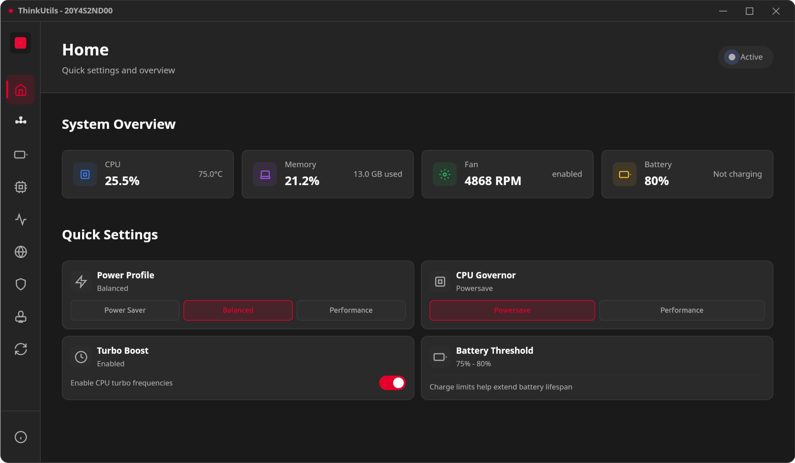
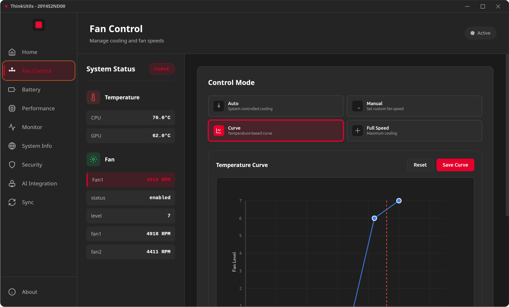
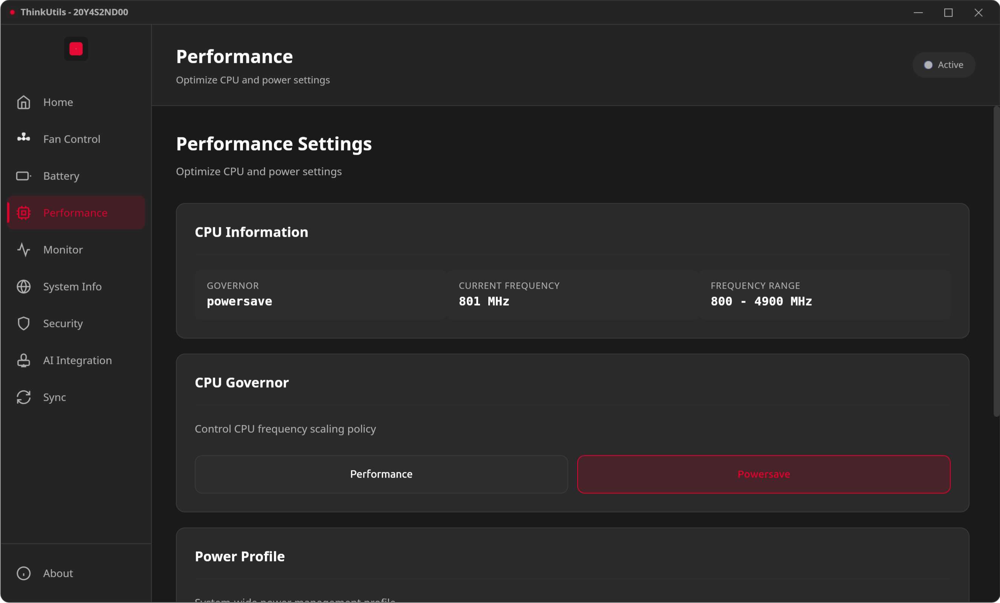
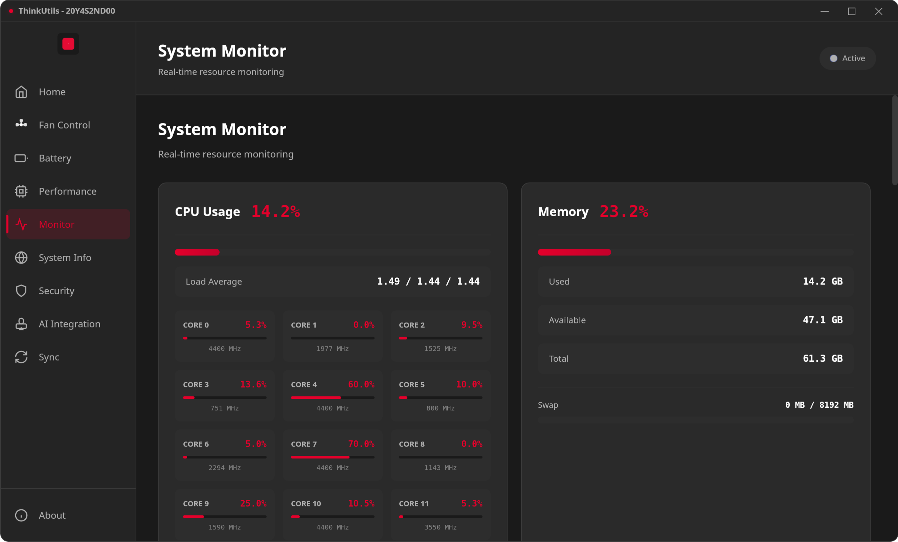
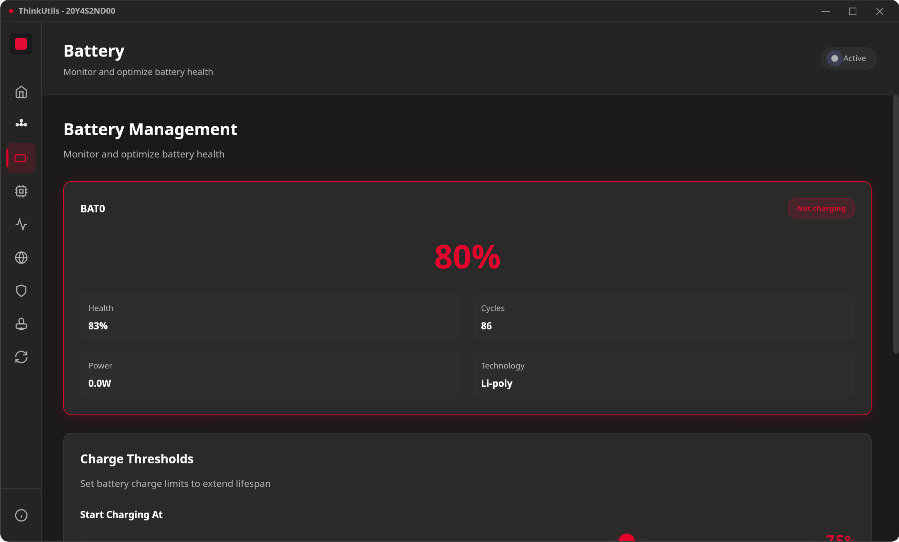
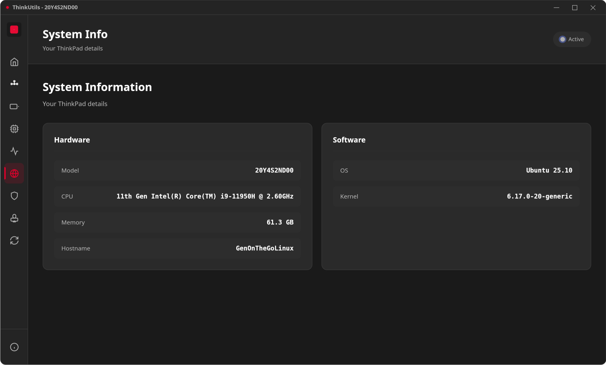
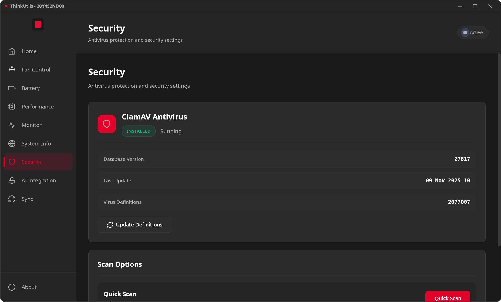
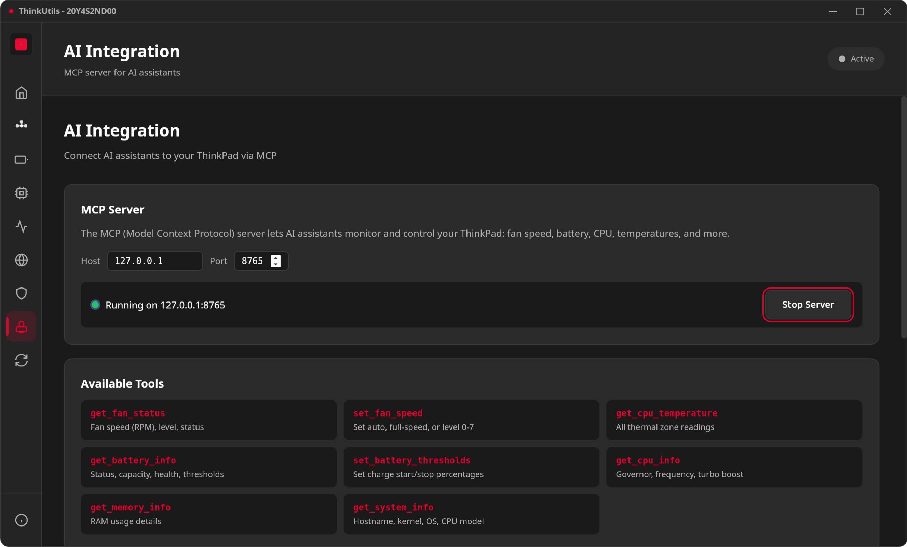
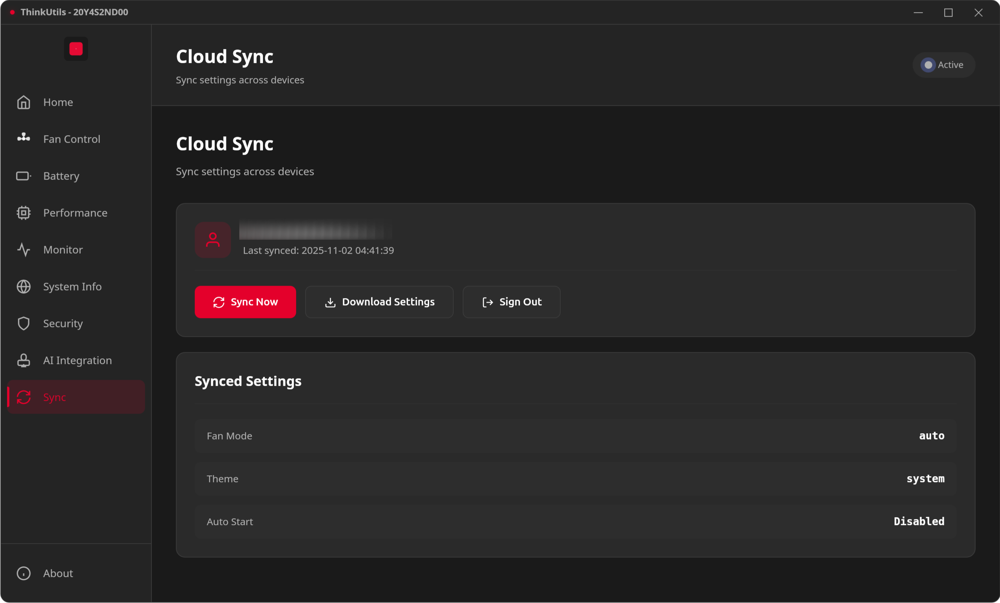

# ThinkUtils

A powerful, native desktop application that unlocks the full potential of your ThinkPad on Linux. Built with Tauri for blazing-fast performance, ThinkUtils gives you complete control over fan speeds, battery health, CPU performance, and system monitoring—all through a sleek, modern interface inspired by ThinkPad's iconic design.


## Screenshots

### Home Dashboard


### Fan Control


### Performance Tuning


### System Monitor


### Battery


### System Information


### Security


### AI Integration


### Settings Sync


## Installation

### Ubuntu/Debian (APT)

```bash
echo "deb [trusted=yes] https://gh.vietanh.dev/ThinkUtils/apt ./" | sudo tee /etc/apt/sources.list.d/thinkutils.list
sudo apt update
sudo apt install thinkutils
```

### Manual Download

Download the latest `.deb`, `.rpm`, or `.AppImage` from [GitHub Releases](https://github.com/vietanhdev/ThinkUtils/releases).

```bash
# Debian/Ubuntu
sudo dpkg -i thinkutils_*.deb

# Fedora/RHEL
sudo rpm -i thinkutils-*.rpm
```

## Features

### 🏠 Home Dashboard
Your command center for quick system adjustments. The home dashboard provides real-time monitoring and quick access to essential controls.

- **System Overview**: Real-time monitoring of CPU usage and temperature, memory usage, fan speed and mode, battery level and status
- **Power Profile Control**: Instantly switch between Power Saver, Balanced, and Performance modes to match your workflow
- **CPU Governor**: Quick access to change CPU frequency scaling policy (Powersave, Balanced, Performance)
- **Turbo Boost Toggle**: Enable or disable CPU turbo frequencies with a single click
- **Battery Threshold Display**: View current charge limit settings (e.g., 40%-80%) configured for battery longevity

### 🌀 Fan Control
Take control of your ThinkPad's legendary cooling system. Whether you need whisper-quiet operation in a library or maximum cooling for intensive workloads, ThinkUtils gives you precise control.

- **Real-time Monitoring**: Watch CPU/GPU temperatures and fan RPM update live—know exactly what's happening inside your machine
- **Multiple Control Modes**:
  - **Auto Mode**: Let the system intelligently manage cooling based on temperature (recommended for most users)
  - **Manual Mode**: Set precise fan speed levels from 0 (silent) to 7 (maximum)—perfect for finding the sweet spot between noise and cooling
  - **Maximum Mode**: Run fans at full blast for intensive tasks like video rendering or gaming
- **Fan Curve Editor**: Draw custom temperature-to-speed curves for fully automated, fine-grained control
- **Temperature Sensors**: Monitor every thermal sensor in your system—CPU cores, GPU, battery, and more
- **Permission Management**: Secure, one-time elevated access using pkexec—no need to run the entire app as root

### 🔋 Battery Management
Extend your battery's lifespan by years with intelligent charge management. ThinkUtils helps you implement the 40-80 rule that professionals use to maximize battery longevity.

- **Multi-Battery Support**: Monitor all installed batteries—perfect for ThinkPads with dual battery setups
- **Charge Thresholds**: Set custom start/stop charging limits (e.g., start at 40%, stop at 80%) to dramatically reduce battery wear and extend its useful life
- **Battery Health**: Track capacity degradation, health percentage, and total charge cycles—know when it's time for a replacement
- **Real-time Stats**: Monitor current charge level, voltage, power draw, and estimated time remaining

### ⚡ Performance Tuning
Squeeze every drop of performance from your CPU or maximize battery life—your choice. Fine-tune how your ThinkPad manages processor power and frequency scaling.

- **CPU Governor Control**: Choose your scaling policy—performance for maximum speed, powersave for battery life, schedutil for intelligent scheduling, or ondemand for dynamic adjustment
- **Power Profiles**: System-wide power management profiles that coordinate CPU, GPU, and other components for optimal performance or efficiency
- **Turbo Boost**: Toggle Intel Turbo Boost on/off—disable it to reduce heat and power consumption, or enable it for burst performance
- **Frequency Monitoring**: Watch your CPU frequency scale in real-time and see min/max ranges for each core

### 📊 System Monitor
A comprehensive system dashboard that shows you everything happening on your ThinkPad. No need for multiple terminal windows—get all your metrics in one beautiful interface.

- **CPU Usage**: Per-core utilization with frequency display and 1/5/15 minute load averages—spot bottlenecks instantly
- **Memory Stats**: RAM and swap usage with detailed breakdowns of used, available, and total memory
- **Disk Usage**: Monitor space usage across all mounted filesystems with device names and mount points
- **Network Activity**: Total bytes and packets transmitted/received for each network interface
- **Process Monitor**: View top processes by CPU and memory consumption with PID, name, and status

### 💻 System Information
Know your machine inside and out. Quick access to all your ThinkPad's hardware specifications and system details.

- **Hardware Details**: Complete specs including ThinkPad model, CPU type, total memory, and operating system
- **Kernel Version**: Current Linux kernel version—useful for troubleshooting compatibility
- **Hostname**: System identification for network management

### 🛡️ Security
Built-in security scanning powered by ClamAV.

- **Virus Scanning**: Scan files and directories for threats
- **Real-time Results**: View scan progress and detected threats

### 🤖 AI Integration (MCP Server)
Built-in MCP (Model Context Protocol) server that exposes system controls to AI assistants like Claude.

- **AI-Powered Control**: Let AI assistants monitor and adjust your ThinkPad settings
- **MCP Protocol**: Standard protocol supported by Claude Code, Claude Desktop, and other AI tools

### 🔄 Google Drive Sync
Never lose your carefully tuned settings. Sync your ThinkUtils configuration to the cloud and restore it on any ThinkPad.

- **Settings Backup**: Sync your fan mode, battery thresholds, and application preferences to Google Drive
- **Cross-Device**: Switch between multiple ThinkPads? Keep your settings consistent across all your machines
- **OAuth Integration**: Secure authentication using Google's OAuth—your credentials never touch ThinkUtils servers
- **Note**: Requires Google OAuth credentials to be configured (see [docs/development/google-oauth.md](docs/development/google-oauth.md))

## How it Works

ThinkUtils combines the performance of Rust with the flexibility of web technologies to deliver a native desktop experience:

- **Rust backend** provides blazing-fast system access and direct hardware control with minimal overhead
- **sensors command** (lm-sensors) reads temperature data from all available thermal sensors
- **/proc/acpi/ibm/fan** interface gives direct access to ThinkPad's fan controller via the thinkpad_acpi kernel module
- **pkexec** handles elevated permissions securely—only specific operations require root access, not the entire application

## Prerequisites

### Debian / Ubuntu
```bash
sudo apt install lm-sensors policykit-1
```

### Fedora / RHEL
```bash
sudo dnf install lm_sensors polkit
```

### Arch Linux
```bash
sudo pacman -S lm_sensors polkit
```

## Setup ThinkPad Fan Control

Before using ThinkUtils, you need to enable fan control:

1. Create or edit the thinkpad_acpi configuration:
```bash
sudo nano /etc/modprobe.d/thinkpad_acpi.conf
```

2. Add this line:
```
options thinkpad_acpi fan_control=1
```

3. Reboot your system or reload the module:
```bash
sudo modprobe -r thinkpad_acpi
sudo modprobe thinkpad_acpi
```

## Development

### Prerequisites
- Rust (1.70 or later)
- Node.js and npm
- Development dependencies for your distribution

**Debian/Ubuntu:**
```bash
sudo apt install build-essential \
    cargo \
    curl \
    file \
    git \
    libayatana-appindicator3-dev \
    librsvg2-dev \
    libssl-dev \
    libwebkit2gtk-4.1-dev \
    npm \
    wget
```

**Fedora:**
```bash
sudo dnf install cargo \
    curl \
    file \
    git \
    libappindicator-gtk3-devel \
    librsvg2-devel \
    npm \
    openssl-devel \
    webkit2gtk4.1-devel \
    wget
```

### Getting Started

1. **Clone and install dependencies:**
```bash
git clone https://github.com/vietanhdev/ThinkUtils.git
cd ThinkUtils
npm install
```

2. **Run in development mode:**
```bash
npm run tauri dev
```

3. **Build for production:**
```bash
npm run tauri build
```

The built packages will be in `src-tauri/target/release/bundle/`

### Code Quality & Linting

ThinkUtils uses comprehensive linting and formatting tools:

- **ESLint** — JavaScript linting
- **HTMLHint** — HTML validation
- **Stylelint** — CSS linting
- **Prettier** — Code formatting
- **Husky + lint-staged** — Pre-commit hooks on staged files

```bash
npm run lint          # Run all linters
npm run lint:fix      # Auto-fix issues
npm run format        # Format all files
npm run validate      # Full validation (lint + format check)
```

Pre-commit hooks run automatically on `git commit`. If linting fails, fix with `npm run lint:fix`, re-stage, and commit again.

### Project Structure

```
ThinkUtils/
├── src/                        # Frontend (vanilla JS, no framework)
│   ├── index.html              # Main UI
│   ├── styles.css              # CSS entry point (imports modules)
│   ├── styles/                 # Modular CSS (see docs/development/css.md)
│   ├── icons/                  # SVG icons
│   ├── assets/                 # Logo and static assets
│   └── js/                     # JavaScript modules
│       ├── app.js              # Initialization entry point
│       ├── state.js            # Centralized state object
│       ├── dom.js              # Cached DOM references
│       ├── navigation.js       # View routing
│       ├── settingsManager.js  # Settings load/save/apply
│       ├── fanCurve.js         # Canvas-based curve editor
│       ├── titlebar.js         # Custom window titlebar
│       ├── about.js            # About dialog
│       ├── templateLoader.js   # HTML template loading
│       ├── utils.js            # Shared utilities
│       └── views/              # One JS file per feature
│           ├── home.js
│           ├── fan.js
│           ├── battery.js
│           ├── performance.js
│           ├── monitor.js
│           ├── system.js
│           ├── security.js
│           ├── sync.js
│           └── mcp.js
├── src-tauri/                  # Backend (Rust)
│   ├── src/
│   │   ├── lib.rs              # Tauri command registration
│   │   ├── fan_control.rs      # Manual fan speed control
│   │   ├── fan_curve.rs        # Auto fan curve (background task)
│   │   ├── battery.rs          # Battery info and thresholds
│   │   ├── performance.rs      # CPU governor, turbo, power profiles
│   │   ├── monitor.rs          # System stats (CPU, memory, disk, net)
│   │   ├── permissions.rs      # One-time permission setup
│   │   ├── security.rs         # ClamAV integration
│   │   ├── sync.rs             # Google OAuth + Drive sync
│   │   ├── settings.rs         # Persistent storage
│   │   ├── system_info.rs      # Hardware info
│   │   ├── auth.rs             # OAuth helpers
│   │   └── mcp.rs              # MCP server
│   ├── tauri.conf.json         # Tauri configuration
│   └── icons/                  # Generated app icons
├── docs/                       # Documentation
├── scripts/                    # Build and install scripts
├── polkit/                     # Polkit policy files
└── screenshots/                # App screenshots
```

### Documentation

Full documentation at [thinkutils.nrl.ai](https://thinkutils.nrl.ai), or browse the `docs/` directory:
- [Getting Started](docs/guide/getting-started.md) — Setup and first run
- [Installation](docs/guide/installation.md) — Install methods
- [Permissions](docs/guide/permissions.md) — How permissions work
- [Architecture](docs/development/architecture.md) — Codebase overview
- [CSS Architecture](docs/development/css.md) — Frontend styling structure
- [Google OAuth Setup](docs/development/google-oauth.md) — Cloud sync configuration
- [Icon Generation](docs/development/icons.md) — Regenerating app icons

## Usage

### Running the Application

Launch ThinkUtils from your application menu or run:
```bash
thinkutils
```

### Navigation

Use the left sidebar to navigate between features:
- **Home** — Quick settings and system overview
- **Fan Control** — Manage cooling and temperatures
- **Battery** — Battery health and charge thresholds
- **Performance** — CPU governor and power profiles
- **Monitor** — Real-time system resource monitoring
- **System Info** — Hardware and OS details
- **Security** — Virus scanning
- **MCP** — AI integration settings
- **Sync** — Google Drive settings backup

## Compatibility

ThinkUtils is designed for IBM/Lenovo ThinkPad laptops running Linux.

**Tested on:**
- ThinkPad T480, T490, T14
- ThinkPad X1 Carbon (various generations)
- ThinkPad P-series workstations

**Requirements:**
- Linux kernel with thinkpad_acpi module
- /proc/acpi/ibm/fan interface available

## Troubleshooting

### Fan control not working
1. Verify thinkpad_acpi is loaded:
   ```bash
   lsmod | grep thinkpad_acpi
   ```
2. Check if fan control is enabled:
   ```bash
   cat /etc/modprobe.d/thinkpad_acpi.conf
   ```
3. Verify the file exists:
   ```bash
   ls -l /proc/acpi/ibm/fan
   ```

### Permission errors
Click "Setup Permissions" in the app, or see [Permissions](docs/guide/permissions.md).

### No temperature data
Ensure lm-sensors is installed and configured:
```bash
sudo sensors-detect
sensors
```

## Contributing

Contributions are welcome! Areas for improvement:
- Support for more ThinkPad models
- UI/UX enhancements
- Bug fixes and optimizations

## License

ThinkUtils is dual-licensed:

- **LGPL v3** — For open source projects
- **Commercial License** — For commercial/proprietary projects

For commercial licensing inquiries, please contact: https://www.vietanh.dev/contact

## Credits

- Built with [Tauri](https://tauri.app/)
- Icons from Lucide

## Disclaimer

ThinkUtils modifies system fan controls. While generally safe, use at your own risk. The authors are not responsible for any hardware damage that may occur from improper use.

**Always monitor temperatures when using manual fan control.**

---

**Made with ❤️ for ThinkPad enthusiasts**
