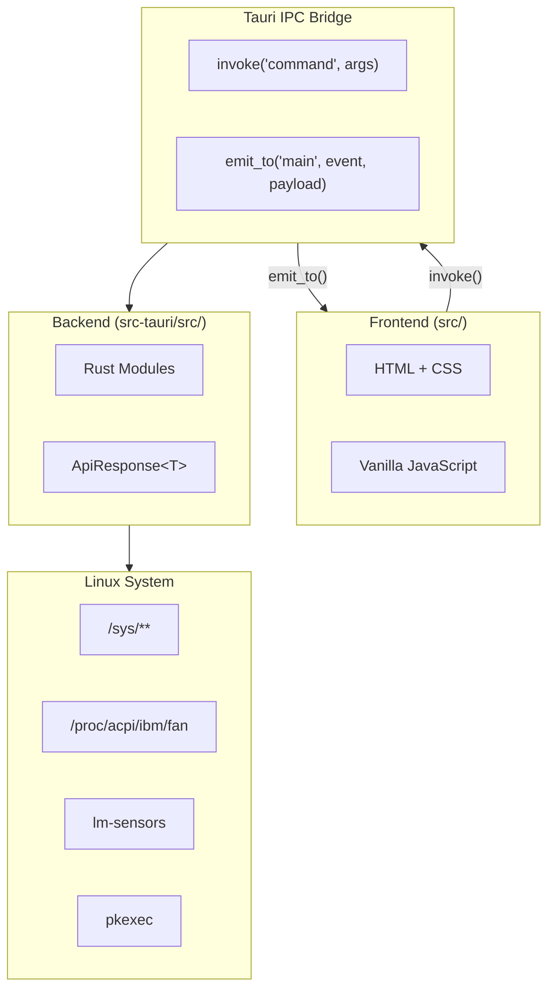
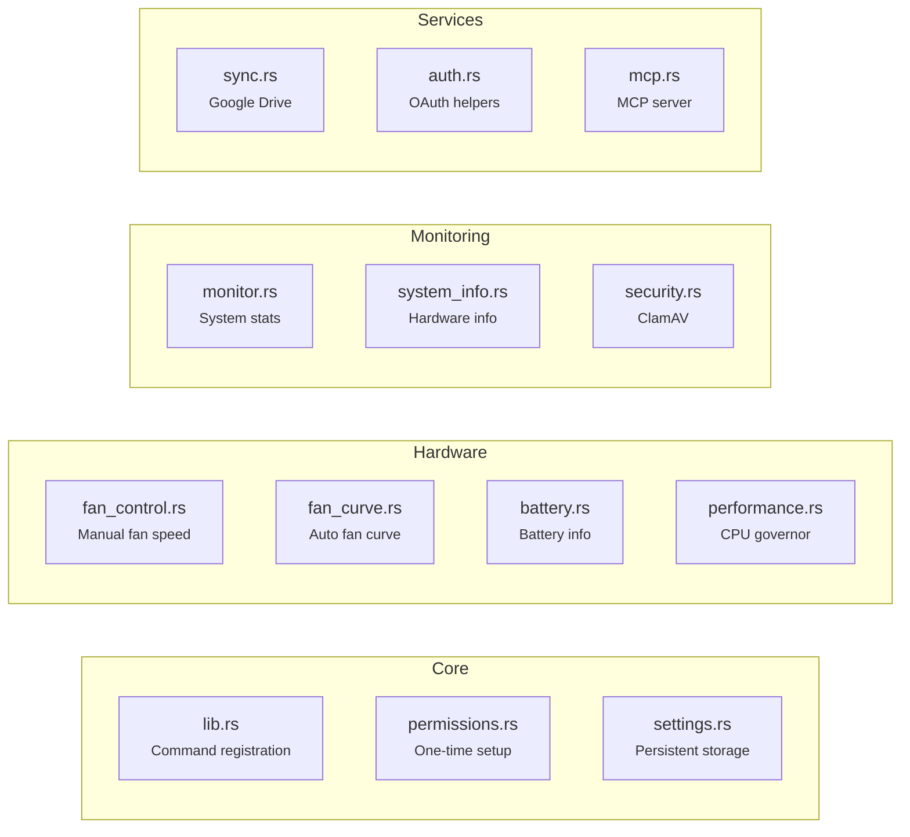
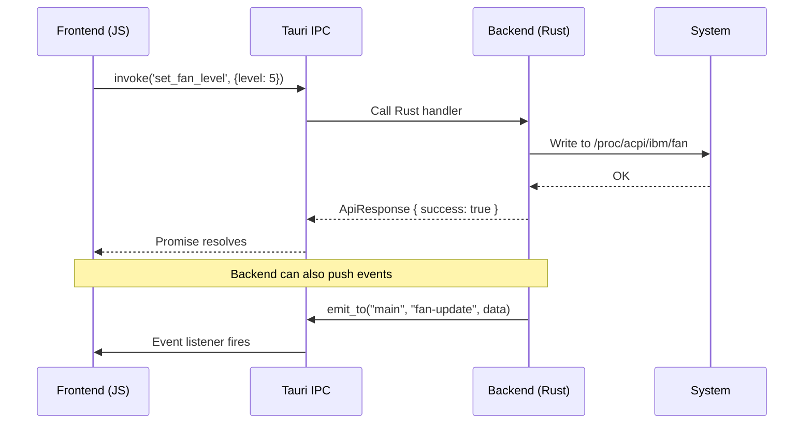
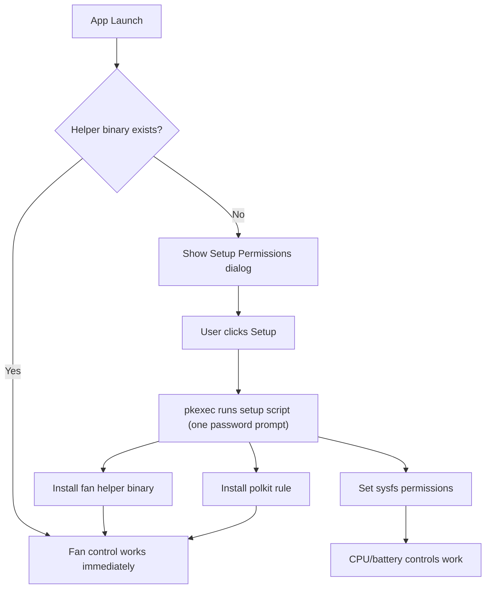

# Architecture

ThinkUtils is a **Tauri v2** app with a Rust backend and vanilla JavaScript frontend (no framework).

## Overview



## Backend (Rust)

All Tauri commands return `ApiResponse<T> { success, data, error }` for consistent error handling. System operations requiring root use **pkexec** (PolicyKit) — the app itself runs unprivileged.

### Modules



### Communication Patterns



## Frontend (JavaScript)

### Core Modules

| Module | Purpose |
|--------|---------|
| `app.js` | Initialization entry point |
| `state.js` | Centralized state object (current mode, intervals, locks) |
| `dom.js` | Cached DOM element references |
| `navigation.js` | View routing via sidebar `data-feature` attributes |
| `settingsManager.js` | Load/save/apply settings coordination |
| `fanCurve.js` | Canvas-based interactive curve editor with draggable points |
| `templateLoader.js` | HTML template loading |
| `titlebar.js` | Custom window titlebar |

### View Modules (`views/`)

One JS file per feature: `home.js`, `fan.js`, `battery.js`, `performance.js`, `monitor.js`, `system.js`, `security.js`, `sync.js`, `mcp.js`.

## Permission Model



See [Permissions](/guide/permissions) for user-facing details.

## Development

```bash
npm run tauri dev       # Dev mode with hot reload
npm run tauri build     # Production build
npm run validate        # Lint + format check
cargo test              # Rust tests (from src-tauri/)
```

## Version Bumping

Version must be updated in 4 files before release:
- `package.json`
- `package-lock.json` (2 occurrences at top)
- `src-tauri/Cargo.toml`
- `src-tauri/tauri.conf.json`

After committing, tag with `git tag vX.Y.Z` and push — GitHub Actions builds and publishes release artifacts.
