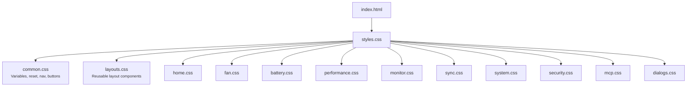
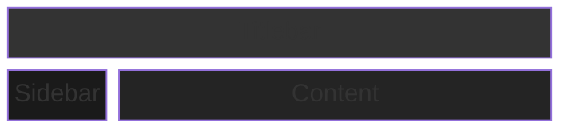
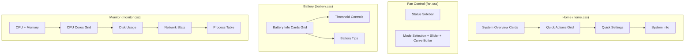
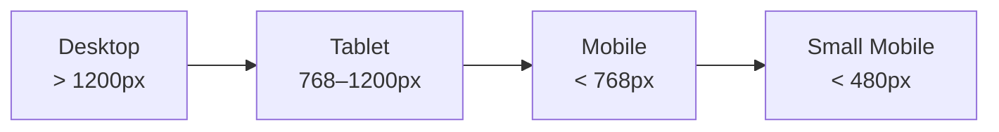

# CSS Architecture

## Import Chain



## App Layout



The app uses a fixed sidebar + scrollable content area. Each page has its own CSS file scoped to that view.

### Page Layouts



## CSS Variables

```css
:root {
  /* Theme Colors */
  --red-primary
  --red-hover
  --red-light
  --red-glow

  /* Backgrounds */
  --bg-primary
  --bg-secondary
  --bg-tertiary
  --bg-elevated
  --bg-card

  /* Text */
  --text-primary
  --text-secondary
  --text-tertiary

  /* Borders & Effects */
  --border-color
  --border-light
  --shadow-sm
  --shadow-md
  --shadow-lg
}
```

## Responsive Breakpoints



## Style Cascade

1. **Browser defaults**
2. **CSS Reset** (common.css)
3. **CSS Variables** (common.css)
4. **Base styles** (common.css)
5. **Layout components** (layouts.css)
6. **Page-specific styles** (individual page CSS)
7. **Responsive overrides** (in each file)

## File Size Breakdown

| File | Lines | Purpose |
|------|-------|---------|
| common.css | ~620 | Shared styles, variables, navigation |
| layouts.css | ~690 | Reusable layout components |
| fan.css | ~715 | Fan control |
| security.css | ~790 | Security features |
| battery.css | ~500 | Battery management |
| home.css | ~470 | Home dashboard |
| monitor.css | ~340 | System monitoring |
| dialogs.css | ~290 | Modal dialogs |
| mcp.css | ~190 | MCP server management |
| sync.css | ~85 | Settings sync |
| performance.css | ~70 | CPU/Performance |
| system.css | ~60 | System information |
| **Total** | **~4,820** | **All styles** |

## Development Workflow

### Adding a New Page
1. Create `src/styles/newpage.css`
2. Add page-specific styles
3. Import in `src/styles.css`:
   ```css
   @import url('./styles/newpage.css');
   ```

### Modifying Existing Styles
1. Identify the page/component
2. Open corresponding CSS file
3. Make changes
4. Test in browser

### Adding Shared Components
1. Add to `common.css` or `layouts.css`
2. Use CSS variables for consistency

## Best Practices

1. **Use CSS Variables**: Always reference variables for colors, spacing
2. **Scope Styles**: Keep page-specific styles in their files
3. **Avoid Duplication**: Move repeated styles to common.css or layouts.css
4. **Naming Convention**: Use descriptive, hierarchical class names (e.g., `.fan-control-card`)
5. **Responsive**: Include breakpoints in the same file as the component
