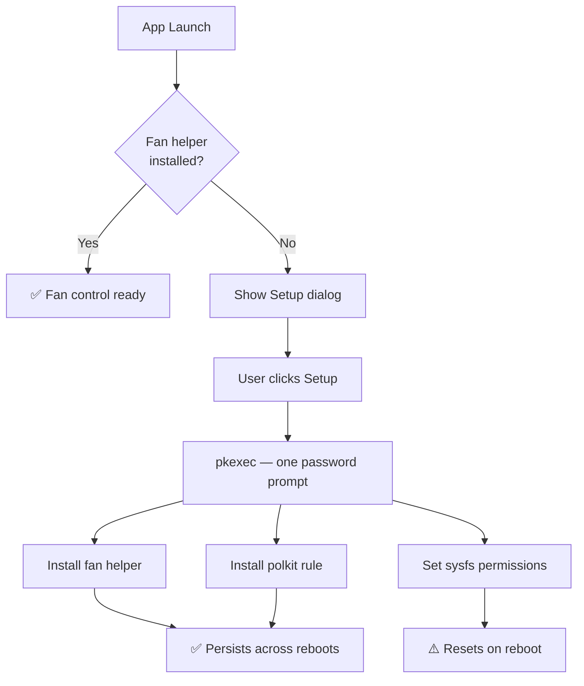

# Permissions

ThinkUtils needs write access to system files for CPU, fan, and battery control. A one-time setup configures everything — no repeated password prompts.

## Quick Setup

1. Install the polkit policy:
   ```bash
   sudo ./install-polkit.sh
   ```

2. Launch the app and click **"Setup Permissions"** when prompted

3. Enter your password once — done!

### Optional: Completely Passwordless

For users in the sudo/wheel group who want zero password prompts:

```bash
./setup-passwordless.sh
```

## How It Works



## What Gets Configured

The one-time `pkexec` call does three things:

### 1. sysfs File Permissions

Sets chmod 666 on system files so your user can directly control:

| File | Purpose |
|------|---------|
| `/sys/devices/system/cpu/cpu*/cpufreq/scaling_governor` | CPU governor |
| `/sys/devices/system/cpu/intel_pstate/no_turbo` | Turbo boost |
| `/sys/devices/platform/thinkpad_hwmon/pwm1*` | Fan PWM control |
| `/sys/class/power_supply/BAT*/charge_*_threshold` | Battery limits |

::: warning
sysfs permissions reset on reboot. Re-run setup from the app if CPU/battery controls stop working. Fan control is unaffected (see below).
:::

### 2. Fan Control Helper

Installs a restricted helper script at `/usr/local/bin/thinkutils-fan-control` that validates commands before writing to `/proc/acpi/ibm/fan`. This **persists across reboots**.

### 3. Polkit Rule

Installs a rule at `/etc/polkit-1/rules.d/50-thinkutils.rules` that allows the fan helper to run without a password dialog. This is important for the background fan curve task that checks temperature every 2 seconds.

## Design Decisions

- **Performance settings are NOT auto-applied on startup** — avoids triggering a pkexec password prompt every launch
- **Fan settings are only restored if the helper is already installed** — avoids dialog spam from the background fan curve task
- Permission checks use `Path::exists()` on the helper binary only — the polkit rules directory is root-only

## Troubleshooting

| Problem | Solution |
|---------|----------|
| Setup dialog doesn't appear | Permissions may already be configured — try using the features |
| Setup fails | Ensure you're in the sudo group (`groups \| grep sudo`) |
| Features broken after reboot | sysfs permissions reset on reboot — click Setup Permissions again |
| Fan control not working | Check if `/proc/acpi/ibm/fan` exists (ThinkPad-specific) |
